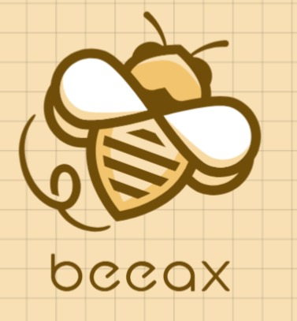
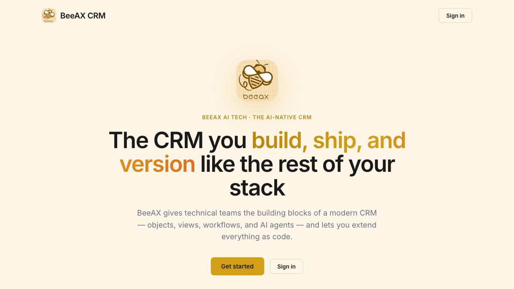
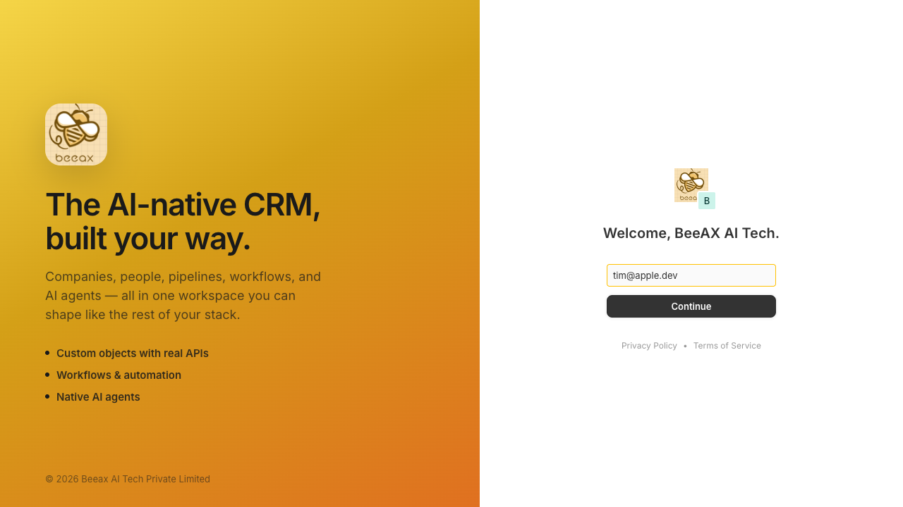
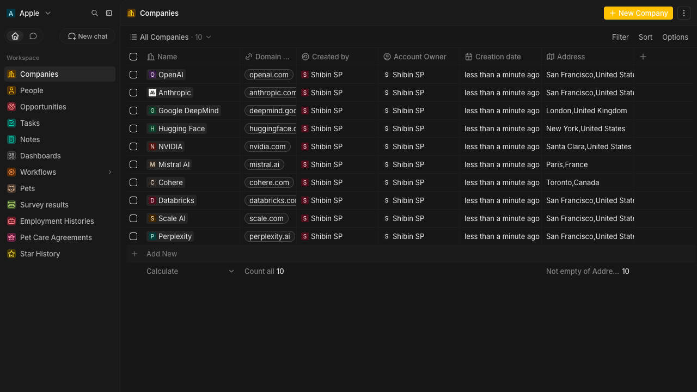
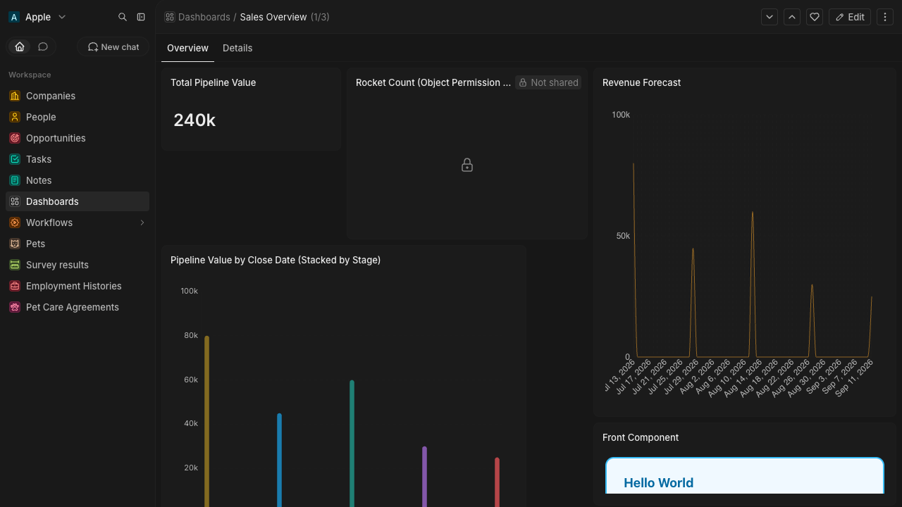

<div align="center">



# BeeAX CRM

### The AI-native CRM you build, ship & version like the rest of your stack.

[](./LICENSE)


[**Repository**](https://github.com/shibinsp/CRM) · [Quick start](#-quick-start) · [Features](#-features) · [Architecture](#-architecture)

</div>

---

**BeeAX CRM** is an open-source, customizable CRM platform. It gives technical teams the
building blocks of a modern CRM — objects, fields, views, workflows, and AI agents — and lets
you extend everything as code.

The data model is fully **metadata-driven**: standard objects (companies, people, opportunities,
notes, tasks) and any custom objects you define are first-class, each backed by a real database
table and a generated GraphQL API.

## 📸 Screenshots

<table>
  <tr>
    <td width="50%"></td>
    <td width="50%"></td>
  </tr>
  <tr>
    <td align="center"><sub><b>Landing page</b></sub></td>
    <td align="center"><sub><b>Sign in</b></sub></td>
  </tr>
  <tr>
    <td width="50%"></td>
    <td width="50%"></td>
  </tr>
  <tr>
    <td align="center"><sub><b>Companies (CRM records)</b></sub></td>
    <td align="center"><sub><b>Dashboard</b></sub></td>
  </tr>
</table>

## ✨ Features

| | |
|---|---|
| 🗂️ **Metadata-driven model** | Custom objects & fields with real tables, indexes, and APIs |
| 📊 **Multiple views** | Table, kanban, and calendar with filters, sorts, and grouping |
| ⚡ **Workflows & automation** | Triggers, actions, and a visual builder |
| 🤖 **AI agents built in** | Assistants and automation powered by the latest models |
| ✉️ **Email & calendar sync** | Gmail / Microsoft via OAuth |
| 🔒 **Granular permissions** | Object-, field-, and row-level access control |
| 🔌 **REST & GraphQL APIs** | Plus API keys and webhooks |
| 🏢 **Multi-tenant** | Isolated per-workspace schemas |

## 🛠 Tech stack

- **Frontend** — React, TypeScript, Jotai, Linaria, Vite, Apollo Client
- **Backend** — NestJS, TypeORM, PostgreSQL, Redis, GraphQL (GraphQL Yoga), BullMQ
- **Monorepo** — Nx workspace managed with Yarn 4 (Node 24)

## 🚀 Quick start

**Prerequisites:** Node `^24.5.0`, Yarn `>= 4`, and either local PostgreSQL + Redis or Docker.

```bash
# 1. Clone
git clone https://github.com/shibinsp/CRM.git
cd CRM

# 2. Install dependencies
yarn install

# 3. Configure environment (development)
cp environments/development/server.env packages/beeax-server/.env
cp environments/development/front.env  packages/beeax-front/.env

# 4. Start Postgres + Redis and initialize the database
bash packages/beeax-utils/setup-dev-env.sh

# 5. Run frontend + backend + worker
yarn start
```

Frontend → http://localhost:3001 · API → http://localhost:3000

## 🧱 Architecture

```
packages/
├── beeax-front/      # React frontend (the CRM UI)
├── beeax-server/     # NestJS backend API + worker
├── beeax-ui/         # Shared UI component library + theme
├── beeax-shared/     # Common types and utilities
├── beeax-emails/     # Transactional email templates
├── beeax-sdk/        # CLI + SDK for building apps as code
├── beeax-docker/     # Docker, Compose, Helm chart, k8s manifests
├── beeax-docs/       # Documentation
└── beeax-website/    # Marketing website

environments/         # Per-env config (development / staging / production)
images/               # Brand assets + screenshots
```

## 🌍 Environments

Multi-environment config lives in [`environments/`](./environments) — per-env app config and
Helm values for **development**, **staging**, and **production** (Kubernetes namespaces
`beeax-development` / `beeax-staging` / `beeax-production`). See
[`environments/README.md`](./environments/README.md).

```bash
environments/deploy.sh staging --dry-run   # preview
environments/deploy.sh production           # deploy
```

## 🤝 Contributing

See [CONTRIBUTING.md](./CONTRIBUTING.md) for setup, conventions, and quality gates, and
[CLAUDE.md](./CLAUDE.md) for the full development guide. Security policy: [SECURITY.md](./SECURITY.md).

## 📄 License

BeeAX CRM is released under the **AGPL-3.0** license — see [LICENSE](./LICENSE).

<div align="center"><sub>© 2026 Beeax AI Tech Private Limited</sub></div>
